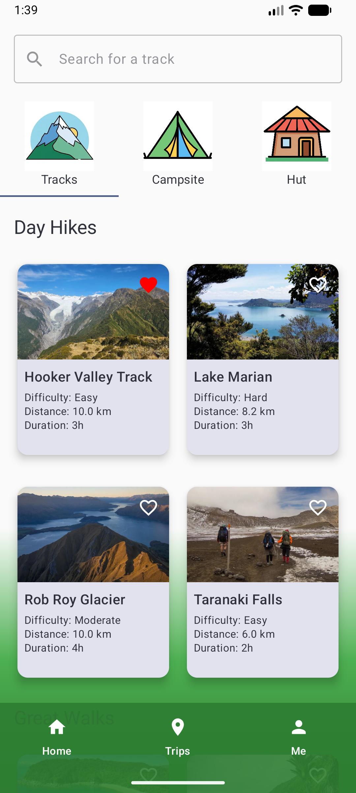
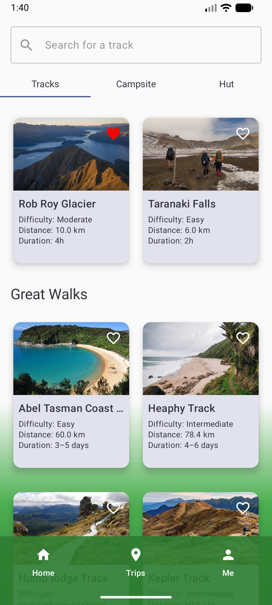
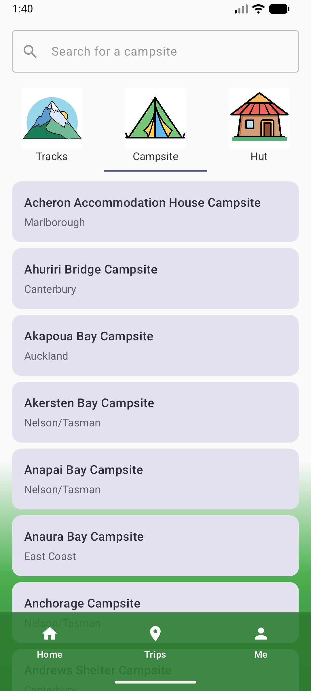
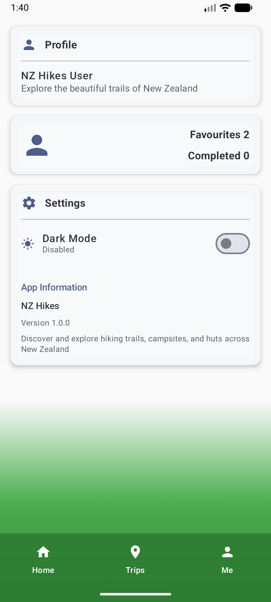
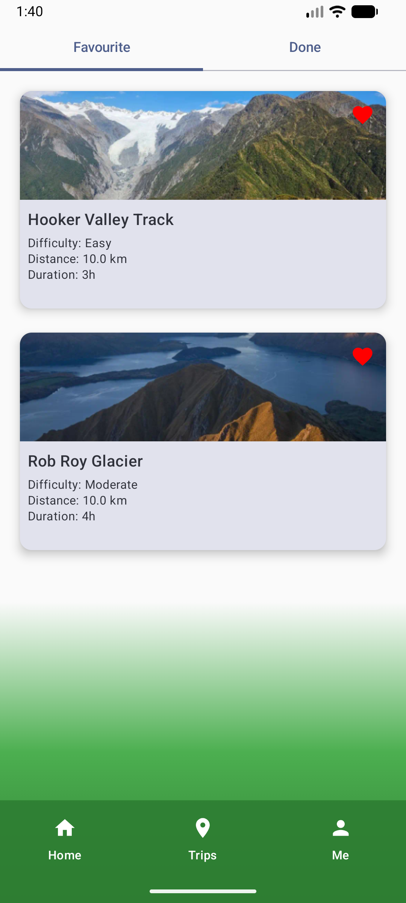
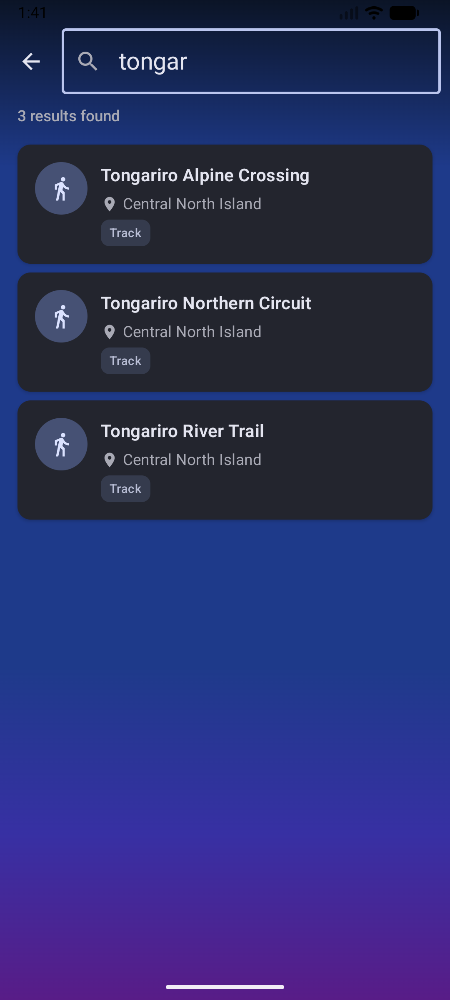
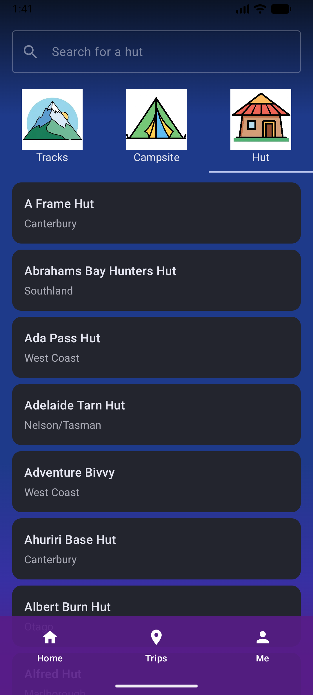
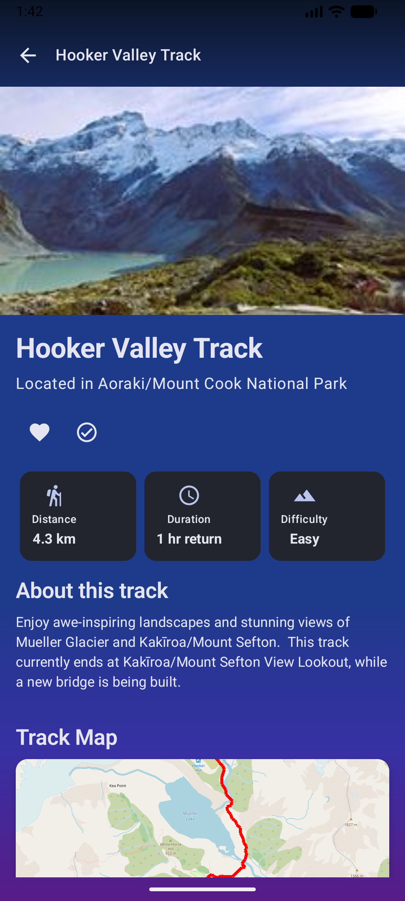

# NZ Hikes - New Zealand Hiking Trails App

## Project Overview

NZ Hikes is an Android application for exploring hiking trails, campsites, and huts across New Zealand. The project uses modern Android development technologies and follows best practices and architectural patterns.

## Tech Stack

- **Language**: Kotlin
- **UI Framework**: Jetpack Compose
- **Architecture**: MVVM + Clean Architecture
- **Dependency Injection**: Hilt
- **Database**: Room
- **Async Processing**: Kotlin Coroutines + Flow
- **Data Persistence**: DataStore
- **Build Tools**: Gradle with Version Catalogs

## Project Structure

```
NZHikes/
├── app/                          # Main application module
├── core/                         # Core modules
│   ├── data/                     # Data layer
│   │   ├── local/               # Local database
│   │   ├── remote/              # Remote data sources
│   │   ├── repository/          # Data repositories
│   │   ├── model/               # Data models
│   │   ├── converter/           # Data converters
│   │   ├── util/                # Utilities
│   │   └── di/                  # Dependency injection
│   └── ui/                      # UI components
│       ├── theme/               # Theme management
│       └── components/          # Common components
├── feature/                     # Feature modules
│   ├── explore/                 # Explore feature
│   ├── trips/                   # Trips feature
│   └── me/                      # Profile feature
└── gradle/                      # Gradle configuration
```

## Screenshots

| | | | |
|:---:|:---:|:---:|:---:|
|  |  |  |  |
|  |  |  |  |

## Key Optimizations

### 1. Code Structure Optimization

- **Modular Architecture**: Feature-based modular design for better maintainability and scalability
- **Clear Layering**: Separation of data, domain, and presentation layers with clear responsibilities
- **Dependency Injection**: Using Hilt for dependency management and improved testability

### 2. Data Layer Optimization

#### Repository Pattern
```kotlin
@Singleton
class HikeRepository @Inject constructor(
    private val hikeDao: HikeDao
) {
    // Added error handling, data validation, and statistics functionality
    fun getAllHikes(): Flow<List<LocalTrack>> = hikeDao.getAllHikes()
        .catch { exception ->
            throw HikeRepositoryException("Failed to get all hikes", exception)
        }
}
```

#### Enhanced Data Models
```kotlin
data class LocalTrack(
    // Added data validation, formatting methods, and immutability
    fun validate(): Boolean
    fun getFormattedDistance(): String
    fun copyWithFavorite(isFavorite: Boolean): LocalTrack
)
```

### 3. UI Layer Optimization

#### Theme Management
- DataStore for persistent theme settings
- Dark/light mode toggle support
- Error handling and state management

#### Common Component Library
```kotlin
// Created reusable UI components
@Composable
fun CommonCard(content: @Composable () -> Unit)
@Composable
fun TitledCard(title: String, content: @Composable () -> Unit)
@Composable
fun LoadingState(message: String)
@Composable
fun EmptyState(icon: ImageVector, title: String, message: String)
```

### 4. Performance Optimization

- **Flow Usage**: Kotlin Flow for reactive data streams
- **Coroutine Management**: Proper coroutine scope management
- **State Management**: StateFlow for state management
- **Memory Optimization**: Avoiding memory leaks and proper lifecycle usage

### 5. Error Handling

- **Unified Exception Handling**: Custom exception classes
- **Data Validation**: Input validation and error prompts
- **User-Friendly Error Messages**: Clear error messages

### 6. Code Quality

- **Kotlin Best Practices**: Using Kotlin language features
- **Documentation**: Complete KDoc documentation
- **Constant Management**: Extracting magic numbers as constants
- **Code Reuse**: Reducing code duplication

## Best Practices

### 1. Architectural Principles

- **Single Responsibility**: Each class and method has a single responsibility
- **Open-Closed Principle**: Open for extension, closed for modification
- **Dependency Inversion**: Depend on abstractions, not concrete implementations

### 2. Coding Standards

- **Naming Conventions**: Clear naming conventions
- **Functional Programming**: Using Kotlin's functional features
- **Immutability**: Preferring immutable objects

### 3. Testing Strategy

- **Unit Tests**: Unit tests for core business logic
- **Integration Tests**: Integration tests for data and UI layers
- **UI Tests**: UI tests for critical user flows

### 4. Performance Considerations

- **Lazy Loading**: Loading data and resources on demand
- **Caching Strategy**: Proper caching for performance improvement
- **Memory Management**: Avoiding memory leaks

## Development Guide

### Requirements

- Android Studio Hedgehog | 2023.1.1 or higher
- Kotlin 2.1.10 or higher
- Android SDK 36
- JDK 11

### Build Steps

1. Clone the project
```bash
git clone <repository-url>
cd NZHikes
```

2. Sync the project
```bash
./gradlew build
```

3. Run the application
```bash
./gradlew installDebug
```

### Code Contribution

1. Create a feature branch
2. Follow coding standards
3. Add necessary tests
4. Submit a Pull Request

## Future Plans

- [ ] Add offline map support
- [ ] Implement user authentication system
- [ ] Add social features
- [ ] Support multiple languages
- [ ] Add push notifications
- [ ] Performance monitoring and analytics

## License

This project is licensed under the MIT License. See the [LICENSE](LICENSE) file for details.

---

**Note**: This is a continuously optimized project. We will keep improving code quality based on user feedback and best practices.
